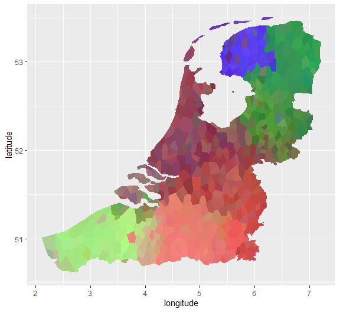
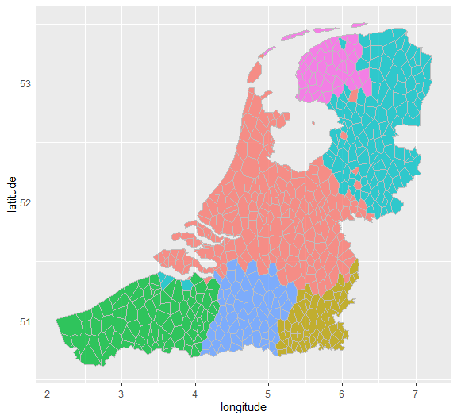

dialectR: Doing Dialectometry in R
================

dialectR is an R package for doing dialectometry, the quantitative study
of dialects. The analyses offered in this package rely upon variants of
edit distance to compute the aggregate distance between phonetic
transcriptions of dialects, which has been shown in prior studies to
correspond with perceptual data of mutual intelligibility.

The developmental version of dialectR can be downloaded with devtools:

``` r
devtools::install_github("b05102139/dialectR")
```

As a preliminary example, we will examine data of Dutch dialects, which
was transcribed in the Goeman-Taeldeman-van-Reenen-Project. The data is
provided in the package, and can be loaded like this:

``` r
library(dialectR)
data(Dutch)
```

This dataset provides data of 562 concepts over 613 sites of Dutch
speaking areas, where the concepts should be columns and the sites
should be rows.

In dialectometry, an important step before further analyses can be done
is to compute the aggregate edit distance between dialect sites. While
an in depth discussion of edit distance is beyond the scope of this
introduction, we briefly remark that it is a metric of distance between
strings, which is computed by how many insertions, deletions, and
substitutions it takes for one string to transform into another. Due to
the existence of multiple entries, missing entries, and the requirement
to normalize for the difference in length between entries in the data
however, dialectR provides a specialized version of edit distance which
meets these needs:

``` r
dialectR::leven("koguma", "kokoimo")
```

    ## [1] 4

``` r
dialectR::leven("koguma", "kokoimo", alignment_normalization = TRUE)
```

    ## [1] 0.5714286

``` r
dialectR::leven("koguma/goguma", "kokoimo", alignment_normalization = TRUE, delim = "/")
```

    ## [1] 0.6190476

The code above shows respectively the plain edit distance between two
strings; the length-normalized distance; and the possibility of
accounting for multiple responses in one site, which is a common
situation when collecting dialect data.

The interest of such a metric is shown when the difference between sites
are aggregated. Assuming the same function arguments as the above, we
can also perform an aggregate calculation of site and site distance:

``` r
distDutch <- dialectR::distance_matrix(Dutch, alignment_normalization = TRUE)
distDutch[1:3,1:3]
```

    ##             Aalsmeer NH Aalst BeLb Aalst BeOv
    ## Aalsmeer NH   0.0000000  0.3232552  0.3988298
    ## Aalst BeLb    0.3232552  0.0000000  0.3442587
    ## Aalst BeOv    0.3988298  0.3442587  0.0000000

This can then be projected onto geography. We provide two such analyses
in the package: one which depends on multidimensional scaling by mapping
three dimensions onto RGB values and mixing them evenly, and one which
utilizes the results of hierarchical clustering. The following two plots
show that the dialect groupings of these two analyses largely converge.
First we present the results of multidimensional scaling:

``` r
dutch_points <- get_points(system.file("extdata", "DutchKML.kml", package="dialectR"))
dutch_polygons <- get_polygons(system.file("extdata", "DutchKML.kml", package="dialectR"))
mds_map(distDutch, dutch_points, dutch_polygons)
```


And here we present that of hierarchical clustering:

``` r
cluster_map(distDutch, cluster_num = 6, method = "ward.D2", kml_points = dutch_points, kml_polygon = dutch_polygons)
```



In addition to such transcription-based methods, we also provide an
acoustic-based method which is capable of computing the distance between
audio data:

``` r
i_audio <- system.file("extdata", "i.wav", package="dialectR")
e_audio <- system.file("extdata", "e.wav", package="dialectR")
acoustic_distance(i_audio, e_audio)
```

    ## [1] 9.414545

The validity of this distance can be shown if we apply it to audio
recordings of IPA vowels. Using the
[recordings](http://www.phonetics.ucla.edu/course/chapter1/vowels.html)
provided by Peter Ladefoged, we show how the distance between IPA vowels
can be used to reproduce the acoustic vowel space:

``` r
# we assume all the vowels are downloaded to a single folder
vowel_dist <- sapply(1:12, function(x){
  sapply(1:12, function(y){
  acoustic_distance(list.files("C:/Users/USER/Downloads/ipa_vowels", full.names = TRUE)[x],
                    list.files("C:/Users/USER/Downloads/ipa_vowels", full.names = TRUE)[y])
  })
})
```

The distance matrix generated from this can be seen below:

``` r
vowel_dist[2:4,2:4]
```

             a         e         i
    a  0.00000 10.509091 10.299737
    e 10.50909  0.000000  9.414545
    i 10.29974  9.414545  0.000000

Now we are in a place to apply multidimensional scaling on the data:

``` r
vowel_mds <- cmdscale(vowel_dist, k = 3)
plot(-vowel_mds[,2], vowel_mds[,1])
text(-vowel_mds[,2], vowel_mds[,1], cex = 1, labels = vowel_names, pos = 2)
```


As can be seen, the distance between the vowels largely correlates with
conventional charts of the acoustic vowel space.

dialectR remains in active development. If you would like to use
dialectR in your research and have any concerns, ideas, or questions, do
feel free to contact us.
